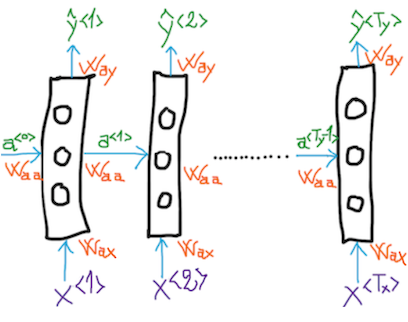

NB: Here we assume that readers are aleady familiar with neural networks fundamentals with respect to activation functions, forward and backpropagation techniques. 
If it is not the case don't worry! we have prepared some awsome references for you to get started :)
 
# Sequence-to-Sequnce neural networks architectures
## Introduction 

In order to deal with series of structured/unstructured data, we need to capture each granular sequence within the data serie. Most importantly, we need to keep track of the previous/next sequences. This is because, within the data serie, we know that each sequence is likely dependent on one or many other sequence(s). Hence it is crucial to accurately reflect this kind of dependencies relationship.

Recurrent neural networks (RNNs) are designed to handle sequence to sequence data, where each sequence can keep track of its backward peers. In some situations we need to go further and collect information on the forwad peers, whitch is also possible under bi-directional RNN models. In this post we will go through the model design of both uni/bidirectional RNNs and then we will explore some other RNNs variations with respect to additional enhancements and capabilities such as memory and attention.

## Practical usages
Areas such as natural language processing (NLP) and speech recognition are very good candidates to RNN architectures. You'll find bellow a non-exhaustive list of some comprehensive usages with real added value to various vital industries.
 

   | Usage | Input (X) | Output(Y) |
   | :--- | :--- | :--- |
   Machine translation | Sequence of words | Sequence of words |
   Sentiment classification | Sequence of words | Score |
   DNA analyis | Alphabet sequence | Protein mapping |
   Music generation | Set of notes as an integer | Sequence of music |
   Voice recognition | Audio clip | Sequence of words |
   Video recognition | Sequence of video frames | Entity, activity recognition|

Most of these situations are adressed through a supervised learning problem, ie given a representation of labeled data (X, Y), the RNN will use a sequence model to learn the adequate set of parameters in order to map a particular input X to the target output Y. 

In this post we will focus on NLP techniques to illustrate how RNNs can be used to handle text content where inputs and outputs can be different lenghts across different examples. We will also see how RNNs can allow features sharing across diffrent positions of the text (elements learned from one piece of a text, can generalize to the subequent parts of same text).

## Representation and notations 

First we need to care about the words representation (inputs and/or outputs)

- Step1: Build a sizable dictionnary (large corpus) that best reflects the words and terms universe within the area of interest. All words within the dictionnary are ordered and indexed.

- Step2: Apply word stemming if appropriate to your purpose (the key benefit here is the corpus size reduction)

- Step3: Tokenize your input. Each tokenized word is represented by a (one-hot) vector of same size as the dictionary. Set 1 at the position where the word matches the dictionary entry and 0 eslewhere. This is simply a binary projection of the word on the dictionnay space.

- Step4: Each (one-hot) vector from step3 is represented within a word embending space (dimentionality reduction techniques). 

| Notation | Description |
| :--- | :--- |
| (X,Y) | Pair X and Y of labeled data from the training set examples |
| Y^ | Predicted element given an input X |
| Tx(i) | The length of the sequence in the ith training example input |
| Ty(i) | The length of the sequence in the ith training example output|
| X(i)\<t\> | The tth element/sequence in the ith training example input|
| Y(i)\<t\> |The tth element/sequence in the ith training example output|
   
## Words embeding (WE)

(WE) captures the relationship between words such as analogies, similarities, or any other business logic that might be of interest. Here some of the key apsects of this concept:

1. Based on the words corpus, identify a space of features, called embeding space, that would best capture the relationships between words wihtin your domain of interest. [Mikolov et. al., 2013, Linguistic regularities in continous space word representation].

2. Construct the embedding matrix (number of embedding vectors x number of words in the text corpus), to represent each word in the new embeding space by electing one of the following options:

   1. Learn a featurized representation from a large text corpus (up to hundred of billions of words), works well in machine translation. Some of the most popular algorithms are decribed bellow:
     1. [Bengio et. al,2003, A neural probabilistic language model]
   
   2. Take advantage from an existing pre-trained word embeding network and transfer its learning to your specific task (smaller training set), in particular tasks like name entity recognition, core reference resolution, text sumurization
   
 3. Similarities that hold in n-densional space, may not hold after t-SNE mapping. t-SNE algorithm takes an n-dimensional vector and maps it in a non-linear way to a 2-dimensional space

 4. One popular way of implementing the similarity function between two words -represented respectively by their associated embeding vectors u and v- is based on the cosine of the angle between the two emebeding vectors u and v, and is expressed as follows:
 
    - cosine(u,v) = (uTv) / (||u||2 ||v||2)
    
    Another way of measuring the similarity between u and v, is based on the euclidean distance between these two vectors.
 
 5. Eliminates biases such as gender, ethnicity, relegion 
 
 

There is some analogy between image encoding through convolutional nets (resulting in a full connected layer), and words embeding through a neural network that learns the embeding vectors given a large text corpus. Yet there is one slight difference between the two, that is in the case of word embeding, the text corpus is fixed and embeded vectors are learnt only for that text corpus, whereas in the image encoding, training set is dynamic, ie the neural network learns encoding even for new images.

## Unidirectional recursive neural networks (RNN)

The figure bellow, illustrates a classic architecture for recurrent neural network. Here we would like to spot two main benefits drawn from this architecture :

1. X and Y can be of different size
2. Features cross-sharing, ie features learnt from earlier layers are shared and factored across later layers leading to a much more efficient way of learning model parameters 

   

Observations:

- a\<0\> can be initialized randomly, however common choice would be a zero vertor intialization;
   
- We can see that to predict the output Y^\<2\>, the second layer takes into account the second word X\<2\> as well as the activation value a\<1\> from time 1. That is when making the prediction for X\<2\> the RNN compiles information not only from  X\<2\> but also from  X\<1\>;
   
- The input parameters Wax are the same across the different layers. Similarely the activation and output parameters (resp.) Waa and Way are shared across the different time steps;

- Broadly speaking speaking, the RNN processes input data from left to right. At each time step t, the RNN takes the input X\<t\> and passes on the activation value a\<t\> to the next step t+1;

- The activation values are calculated through a forward propagation process governed by the following equations:
   - a\<t\> = g1(Waaa\<t-1\> + WaxX\<t\>  + ba);
   - Y^\<t\> = g2(Waya\<t\> + by);
   - The g1 and g2 may differ from each other. Generally we use functions such as tanh, ReLU and sigmoid.

- The parameters   Waa,  Wax, Way, ba, by are learnt through an optimizer such as gradient descent or equivalent, that minimizes the logistic loss function L(Y^,Y) stated bellow. This is an iterative process where the parameters are updated using the partial derivatives of L with respect to each parameter. The partial derivatives are obtained by runing a backward propagation procedure to train your RNN. 

   - L(Y^,Y) = - Sumt=1Ty(Y\<t\>log(Y^\<t\>) + (1-Y\<t\>)log(1-Y^\<t\>))

- The architecture illustrated above has a many-to-many structure where inputs and outputs have equal length, that is (Tx = Ty). However in the case of speech recognition, a one-to-many architecture is more suitable. Similarly a many-to-one architecture is a more appropriate fit when it comes to sentiment analysis. Finally the encoder-decoder architecture (many-to-many with Tx different from Ty) works well for mahine translation purposes.

- Unidirectional RNNs arichitecture put some training challenges, in particular when:
   1. The RNN gets deeper, the vanishing/exploding gradients prevent from properly learning the model parameters. The GRU and LSTM sections describe how this issue has been resolved.   
   2. Your prediction at time step t, depends on information that comes later in the sequence. Classic RNNs only incorporates information prior to t. In order to capture information that comes later on, ie after time step t, the Bidirectional recursive neural networks (BRNN) architecture is more convinient choice.

## Gated Recurrent Units (GRU)
The basic RNN model suffers from lack of long term memory due to vanishing gradients problem, in particular when the data squence exhibits long term dependencies, where elements from later time steps are dependent on elments from the very early time steps. 
In fact, as the RNN gets deeper, the gradients from latest layers struggle in propagating back to update the paramters from the very early layers. Exploding gradients may lead to the same situation, however the gradient clipping may be used as a workaround solution to fix the problem.

- The Gated Recurrent Units (GRU) model is a variation of the RNN model, it has been designed to adress the lack of long term memory also known as "local influences problem". Technically speaking the GRU create a new output for each layer unit, called the "memory cell", denoted as c\<t\>. 
- c\<t\> carries out any desired activation value from earlier layers up to the time step t where it is no longer needed. It will then be replaced by the new candidate cell memory value c-tilda\<t\>. 

- The memory update decision is driven by an update-gate sigmoid function Gu that takes 1 when the cell memory needs to be replaced by c-tilda\<t\> and 0 otherwise. 

- The candidate cell memory c-tilda\<t\> is also driven by a relevance gate, denoted Gr, indicating how much c\<t-1\> is relevant to the calculation of the candidate c-tilda\<t\>.
   
   - c\<t-1\> = a\<t-1\>
   
   - Gr = sigmoid(Wrcc\<t-1\> + WrxX\<t\>  + br)
   
   - c-tilda\<t\> = tanh( Gr*Wccc\<t-1\> + WcxX\<t\>  + bc)
   
   
   - Gu = sigmoid(Wucc\<t-1\> + WuxX\<t\>  + bu)
   
   - c\<t\> = Gu*c-tilda\<t\> + (1-G\<u\>)*c\<t-1\>

Under such a construction, even when Gu gets very small (due vanishing gradients), c\<t\> will keep track of the memorised value c\<t-1\>.

## Long short term model (LSTM)
LSTM stands from Long term short memory, it is a more general version of GRU, with the folowing variations:

   - c-tilda\<t\> = tanh( Wcaa\<t-1\> + WcxX\<t\>  + bc), (no relevance gate Gr. uses a\<t-1\> rather than c\<t-1\>) 
   
   - Gu = sigmoid(Wucc\<t-1\> + WuxX\<t\>  + bu), (This the update gate, same as the one used in the GRU model)
 
  - Gf = sigmoid(Wfaa\<t-1\> + WfxX\<t\>  + bf ), (The forget gate Gf replaces the (1-Gu) term in the GRU model, used to carry the old memory cell value c\<t-1\>)
  
  - Go = sigmoid(Woaa\<t-1\> + WoxX\<t\>  + bo ), (This is the output gate, it drives the values of a\<t\> given c\<t\>)
  
  - c\<t\> = Gu*c-tilda\<t\> + Gf*c\<t-1\>
 
  - a\<t\> = Go*tanh(c\<t\>)
 
(*), denotes elements wise product

The forget gate Gf, allows to store in the old memory cell value c\<t-1\>. By construction the LSTM is more complex/flexible than GRUs, but they require more ressources to train the model parameters.
 
## Bidirectional recursive neural networks (BRNN)
The main benefit from BRNNs is that for a given time step t, it captures information from earlier and later sequences, ie sequences placed before and after t.   

The BRNN is defined by an acyclic graph, where given an input sequence X\<1\> to X\<Tx\>, the neural networks runs the forward propagation through two levels of activation:
1. A forward sequence of activation values starting from fwd_a\<1\> to fwd_a\<Tx\> 
2. A backward sequence of activation values starting from bwd_a\<Tx\> to bwd_a\<1\>

The prediction Y^ at time t is based on both forward and backward activation values at time t (fwd_a\<t\> and bwd_a\<t\>), whitch allows the prediction to factor in information from steps prior to time t, as well as information after time t.
 
Elementary blocks within the BRNN can either be GRU or LSTM.

## Attention model

## Conclusion

